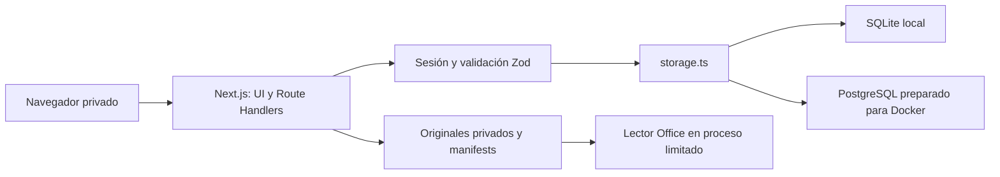
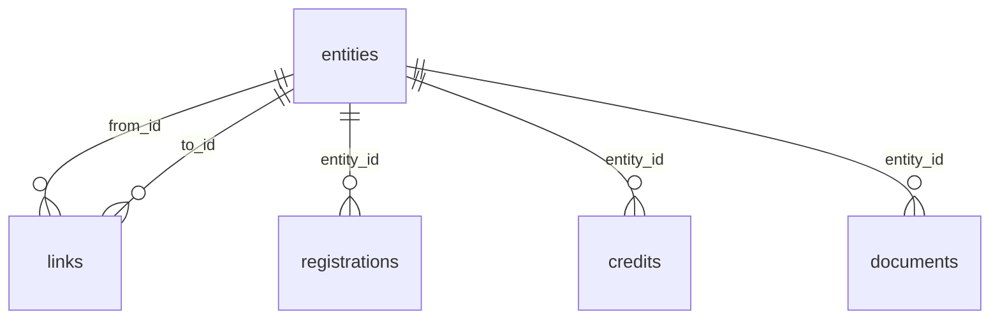

# Especificación técnica

## Arquitectura

Actualización: 2026-09-14. Docker/PostgreSQL ya superaron una prueba local aislada; el NAS y HTTPS externo siguen sin validar. Consulta [PROJECT_STATUS.md](PROJECT_STATUS.md) para retomar el trabajo y [VALIDATION.md](VALIDATION.md) para resultados fechados.

No hay un Deploy Vercel configurado: la arquitectura concreta acordada es Node standalone con almacenamiento privado persistente. Cambiar de alojamiento exigiría revisar almacenamiento, procesos de lectura y límites de subida.

Next.js 16.3.4 App Router, React 19.3.0, TypeScript estricto y Zod. Versiones consultadas en npm y documentación de Next/Supabase/pg/Docker mediante Context7 el 10 de septiembre de 2026. Dependencias exactas y lockfile. Supabase fue evaluado y retirado tras la decisión del propietario de usar PostgreSQL propio con Docker.

`src/lib/catalog.ts` define el contrato portable. `storage.ts` selecciona PostgreSQL (`CATALOG_STORAGE=postgres`) o SQLite local para revisión sin Docker. PostgreSQL usa `pg`, SQLite usa `better-sqlite3` con WAL, claves foráneas y synchronous FULL. Docker ejecuta aplicación Node y PostgreSQL 18 en servicios separados. Sin código ni credenciales de base en el navegador.

## Modelo relacional

`entities` contiene composición, grabación, vídeo o lanzamiento, con UUID, tipo, título y código indexables. El resto de metadatos tipados se almacena como JSONB en PostgreSQL y JSON validado en SQLite. Es un modelo relacional híbrido: relaciones, registros, autorías y documentos tienen tablas propias y referencias; no es una única tabla con todo el catálogo.

`links`: recording_work, release_recording, release_work, video_recording; la validación impide referencias colgantes, tipos incompatibles y duplicados. Obras/grabaciones y lanzamientos admiten múltiples asociaciones. `credits` conserva nombre, rol, porcentaje nulo si se desconoce y fuente. Se rechazan porcentajes negativos, superiores a 100 o sumas superiores a 100. Un total menor de 100 se permite como reparto incompleto.

`registrations`: entidad, estado, aplicabilidad independiente, enlace de evidencia, fecha de revisión, notas y declaraciones originales. `documents`: categoría, ficha propietaria, enlace HTTPS opcional, notas y metadatos binarios opcionales. No se descargan automáticamente URLs ni se ejecuta HTML importado. `metadata` almacena revisión global y cobertura; `audit_log` registra revisiones y número de fichas, sin contraseñas.

## Cálculos

El contrato JSON tiene `version: 1`, `revision`, `importedAt`, `sourceSummary`, `entities`, `links`, `registrations`, `credits`, `documents` y `proOrganizations`. Una escritura sustituye las colecciones en transacción y aumenta la revisión; `proOrganizations` se une a la lista existente. SQLite usa transacción inmediata; PostgreSQL bloquea la fila de revisión con `FOR UPDATE`. El audit log registra guardados, pero no es un historial recuperable de todas las versiones.

| Relación | Origen → destino |
|---|---|
| `recording_work` | Grabación → composición |
| `release_recording` | Lanzamiento → grabación |
| `release_work` | Lanzamiento → composición |
| `video_recording` | Vídeo → grabación |

Estados: registered, in_progress, pending, unchecked, not_applicable. Denominador: únicamente registros de aplicabilidad yes, excluyendo not_applicable. La aplicabilidad unknown aparece separada. Cero aplicables devuelve null y se presenta como raya, no como 100 %. Declarado: estado registered. Verificado: además, evidencia HTTPS y fecha de revisión explícita. Tener ISWC, ISRC, UPC o país de registro no acredita un registro. La revisión es declaración del propietario después de consultar la evidencia; no una consulta automática a entidades.

La ficha de obra reúne registros propios, grabaciones, lanzamientos directamente asociados y vídeos/lanzamientos de esas grabaciones. Los IDs se reúnen en un conjunto para no contarlos dos veces. Para otras clases de ficha, `registrationsFor` recoge solo sus registros propios. La búsqueda ignora tildes y encuentra la obra por códigos de sus grabaciones.

## Importación real y límites

Las cuatro consultas de Notion devolvieron has_more=false: 16 composiciones, 17 grabaciones, 5 vídeos y 14 lanzamientos. Se filtraron 4 lanzamientos de otro artista. Este resultado describe las bases consultadas, no prueba que las aproximadamente 70 canciones del artista estén allí.

Dos pares comparten ISWC: BILINGUE / remaster y BAJO LA LUNA / Reparto. Se agrupan provisionalmente conservando todas las filas originales en sourceRecords, URLs y valores originales; las declaraciones contradictorias quedan Sin comprobar. La agrupación se advierte y no modifica Notion. Los títulos se limpian solo de marcadores Markdown. Lyrics de Notion representa idioma, no contenido de letra. Los porcentajes no existen en la fuente consultada y permanecen nulos.

La relación Recording/Track de vídeos apunta a la propia base de vídeos. Se preserva la anomalía en notas y filas originales; no se fabrican enlaces por coincidencia de título/ISRC. El propietario puede vincular las fichas desde la UI. Las fechas/estado Done de lanzamientos no se convierten automáticamente en Publicada. La columna de propiedad intelectual contiene un país, no un certificado verificado.

No se ha inventariado Drive, importado audio binario, validado certificados españoles ni comprobado estados en los portales de entidades. La aplicación ya admite subidas privadas locales; el contenido real de Drive no se ha incorporado automáticamente.

## API y protección

- GET /api/catalog: autenticación obligatoria, respuesta privada sin caché.
- PUT /api/catalog: autenticación, comprobación Origin, tamaño máximo 10 MB, validación integral y transacción. Revisión obsoleta devuelve 409; entrada inválida, 400. No hay escrituras parciales.
- POST /api/auth: contraseña única del propietario, hash scrypt con salt, sesión firmada HMAC de 8 horas. Rate limit por proceso de 10 intentos/minuto, cookie HttpOnly/SameSite Strict/Secure en producción.
- DELETE /api/auth: elimina cookie, exige Origin.
- GET /api/health: público; estado mínimo y consulta de salud a PostgreSQL. En modo SQLite no comprueba la apertura de la base. No devuelve contenido del catálogo.
- POST /api/documents/upload: cuerpo binario, parámetros `entityId`, `kind`, `name`, `filename` en la URL; devuelve catálogo actualizado. Requiere sesión y Origin.
- GET /api/documents/[id]: UUID del documento del catálogo, no del archivo físico; descarga por defecto o `mode=preview/read`. Requiere sesión.
- GET /api/backup: ZIP con metadatos y originales referenciados; requiere sesión.
- POST /api/backup: cuerpo ZIP binario; requiere sesión y Origin. Devuelve catálogo restaurado o error sin sustitución parcial de metadatos.

Rechazos habituales: 401 sin sesión, 403 por Origin ajeno en escrituras, 400 por contenido inválido, 409 por revisión concurrente y 413 por exceso de tamaño. Los medios admiten 206/416 para rangos. JSON se exporta desde el catálogo de la interfaz y se recupera mediante PUT /api/catalog; no existe una ruta independiente de exportación JSON.

Producción cierra el acceso si faltan secretos. DEV requiere CATALOG_LOCAL_PREVIEW=true, NODE_ENV=development y hostname loopback; el comando dev escucha solo 127.0.0.1. La aplicación es de propietario único, sin registro público ni multitenancy. El rol catalog_app de PostgreSQL no es superusuario y no tiene CREATE después de inicializar. No se usa RLS de Supabase porque no existe acceso público directo a PostgreSQL ni usuarios múltiples; si se añade colaboración, debe incorporarse autorización por propietario y RLS antes de habilitarla.

Rate limit en memoria y sesiones sin revocación central son apropiados para esta primera instancia única; no se deben replicar servidores sin añadir almacenamiento común de intentos/sesiones. No se transmite telemetría propia ni se incrustan reproductores de terceros.

## Despliegue y portabilidad

Dockerfile multietapa, salida standalone, usuario node sin privilegios, contenedor app de solo lectura y PostgreSQL sin puerto publicado. Volumen persistente independiente de imágenes. El lockfile conserva instaladores opcionales por plataforma. Imágenes base Node 24 y PostgreSQL 18 para Linux; aún no se ha probado Build multiarch.

NAS observado en UI autenticada: Synology DS225+, Celeron J4125 x86-64, 4 núcleos, 2 GHz, RAM 2048 MB, DSM 7.3.2-86009 Update 4. Container Manager ya está instalado. No se ha desplegado ni modificado. Se propone construir linux/amd64 fuera del NAS por la RAM disponible. El ensayo real Docker local pasó el 14 de septiembre; la incidencia anterior queda como historial. El propietario exige revisar y probar a fondo antes de trasladar nada al NAS.

## Archivos privados, lectura y copias completas

Los binarios se guardan fuera de `public` y de la base de datos: `CATALOG_FILES_DIR`, o `CATALOG_DATA_DIR/files`, por defecto `private/files`. Nombres físicos UUID, manifest de metadatos por binario, nombre original solo como metadato, SHA-256 y tamaño. No se deduplican por nombre: varias letras, certificados o másteres de una misma categoría conservan sus originales. El formato físico es independiente de la categoría. Un documento también puede contener solo notas o un enlace opcional.

POST `/api/documents/upload` recibe un binario por stream y añade metadatos de forma transaccional; autenticación y Origin obligatorios. Se limita a 512 MiB por archivo; la interfaz agrupa hasta 10 por tanda y conserva los pendientes tras un fallo parcial. La extensión de los formatos previsualizables se contrasta con su firma. Los formatos desconocidos se sirven únicamente como descarga `application/octet-stream`. Se rechazan nombres con rutas/control, archivos vacíos, tamaño excesivo y referencias de metadatos que no coinciden con los manifests privados. No se ejecutan archivos subidos.

GET `/api/documents/[id]` exige sesión, resuelve el documento desde el catálogo y permite descarga original. `?mode=preview` sirve PDF/audio/vídeo con tipos acotados, no-store, nosniff, same-origin y CSP. Rangos HTTP permiten reproducción/búsqueda de medios; rangos inválidos devuelven 416. PDF usa el lector del navegador con alternativa de descarga. WAV/MP3/FLAC/Ogg/M4A y MP4/WebM dependen de los códecs instalados; no se garantiza reproducción universal.

`?mode=read` convierte TXT/MD/CSV/LRC/JSON UTF-8 a texto escapado, DOCX a texto con Mammoth y XLSX a tablas con ExcelJS. Nunca se inserta HTML procedente del documento. Office se procesa en un proceso hijo sin secretos heredados, con heap máximo 256 MiB, tiempo máximo 12 s y hasta dos procesos simultáneos. El ZIP interno se valida con yauzl: tamaño descomprimido total 40 MiB, 2.000 entradas, 20 MiB por entrada, sin cifrado, macros, ActiveX, objetos incrustados ni enlaces externos de libros. Lectura máxima de fichero 20 MiB; texto máximo 200.000 caracteres; Excel hasta 10 hojas, 200 filas y 30 columnas/hoja. No se calculan fórmulas ni se abren enlaces. DOC/XLS, documentos complejos, formatos no admitidos o códecs no disponibles conservan la descarga original. No hay conversores externos.

GET `/api/backup` exporta un ZIP portable con `catalog.json` y cada binario referenciado; POST restaura ZIP de hasta 8 GiB con autenticación, Origin y confirmación de sustitución en la interfaz. La importación valida estructura, rutas, recuentos, tamaños, tipos y SHA-256, prepara UUID nuevos y solo después sustituye metadatos en una transacción con control de revisión. Un fallo conserva el catálogo anterior y limpia los archivos preparatorios. Los binarios de revisiones anteriores no se borran automáticamente; no hay recolección destructiva de huérfanos. El ZIP contiene únicamente archivos referenciados por esa copia. La copia JSON sigue disponible, pero para trasladar binarios a otro equipo debe utilizarse el ZIP completo.

Compose añade un volumen `catalog_files` montado en `/data/files` y propiedad del usuario node. La raíz del contenedor sigue siendo de solo lectura. La imagen standalone incorpora el lector y sus dependencias; el Build valida exclusión de datos privados. El proxy Caddy admite hasta 9 GB de cuerpo; cada endpoint aplica su límite propio. El ensayo del 14 de septiembre comprobó escritura como node, reinicio y recuperación en otro volumen Docker con un TXT sintético; no cubre todas las cargas ni el NAS.

Dependencias de lectura consultadas con Context7: Mammoth, ExcelJS, yauzl y yazl. ExcelJS usa un override de uuid 11.1.1 para eliminar la vulnerabilidad transitiva reportada por npm audit; lectura XLSX y Build se verifican con ese override.

## Géneros y créditos ampliados

`genre-options.json` conserva las opciones Genre obtenidas del schema de Notion: 36 en Recordings/Tracks y la grafía adicional Reggaeton en Releases, 37 distintas. Works y Videos no tienen Genre. No se mezclan las opciones Subgenre. El selector compartido permite búsqueda, elección y escritura explícita de otro valor; añade géneros ya presentes sin eliminarlos. La ficha unificada muestra todos los géneros de sus grabaciones pertinentes junto al propio, con procedencia consultable. La visualización no modifica la composición ni selecciona arbitrariamente una versión.

`credits.scope` distingue `professional` de `authorship`; ausente conserva la semántica de los créditos de autoría de la versión anterior. Los créditos profesionales requieren share=null. Varias personas pueden tener el mismo rol y una persona varios roles, cada participación vinculada a su entidad. Los porcentajes se editan por separado, siguen sin presumirse y la suma se valida por entidad. Ningún rol profesional concede titularidad.

`enrichSourceCredits` importa de manera aditiva e idempotente Producer, Writer(s) de grabaciones, artista principal de lanzamientos y atribuciones explícitas de vídeos. Los nombres proceden de las fichas de personas de Notion y solo se guardan nombre/enlace, no datos bancarios o de contacto. Los créditos ambiguos del texto de vídeos permanecen en sourceRecords/notas, sin inferir roles. La migración local añadió 53 créditos respaldados, preservando los 14 registros de autoría y todos los géneros originales. No modifica Notion.

## Lanzamientos, UPC/EAN y sociedades PRO

El panel Lanzamientos y UPC en composición/grabación permite crear un lanzamiento o asociar uno existente. `release_work` y `release_recording` admiten varias canciones por lanzamiento y varios lanzamientos por canción. El UPC/EAN es `entities.code` de la entidad release, siempre texto y sin eliminar/agregar ceros; no hay unicidad por canción ni fusión automática por código. Un álbum compartido se edita una vez y se refleja desde todas sus canciones. Una canción puede mostrar Single y Álbum/EP a la vez.

`releaseType` admite single, ep, album y unspecified. Se recuperaron los tipos de los 10 lanzamientos locales desde la propiedad Type de Notion (schema Single/Album/EP). No se deduce el tipo por número de pistas. La selección manual posterior tiene prioridad; sourceRecords conserva Type y UPC originales.

La entrada nueva o modificada de códigos admite UPC-A de 12 dígitos y EAN-13 de 13, con comprobación módulo 10. Los originales anteriores y los coincidentes con sourceRecords se conservan aunque sean irregulares y se advierten en pantalla. Una copia ZIP conserva datos históricos. El checksum no prueba asignación, titularidad ni registro. Fuentes primarias consultadas: [GS1, cálculo del dígito de control](https://www.gs1.org/services/how-calculate-check-digit-manually) y [GS1, UPC-A y EAN-13](https://support.gs1.org/support/solutions/articles/43000734137-what-is-the-gs1-barcode-commonly-used-for-trade-item-identification-).

`registrations.organization` identifica la sociedad concreta de un registro PRO. La categoría agency=PRO se conserva; BMI/ASCAP/SGAE y otra sociedad se editan sin crear otra fila, conservando ID, estado, evidencia, notas y declaraciones originales. Fichas, dashboard y filtros muestran PRO junto al nombre. Los PRO importados sin entidad específica siguen como Sin especificar. El CRM de David declara afiliación BMI, pero no acredita el registro de cada obra: no se ha aplicado esa afiliación a sus registros automáticamente.

La unicidad es por entidad, categoría y sociedad, no solo por categoría. No se permite coexistir un PRO genérico y sociedades concretas en la misma entidad, para evitar duplicar el avance. SQLite migra atómicamente la restricción antigua conservando payload e IDs. PostgreSQL nuevo usa el índice de expresión actualizado; instalaciones previas requieren `database/migrations/002-registration-organizations.sql`. Las migraciones PostgreSQL 002/003 se ejecutaron el 14 de septiembre sobre esquema anterior sintético, conservando IDs y comprobando repetición idempotente.

## Catálogo compartido de sociedades PRO

La tabla pro_organizations(key, name) persiste opciones independientemente de los registros. La clave recorta extremos, reduce espacios consecutivos y compara sin distinguir mayúsculas; conserva la primera grafía legible y no fusiona nombres distintos. El campo JSON proOrganizations incluye las opciones en exportaciones JSON/ZIP. Cada escritura incorpora opciones anteriores y nombres PRO nuevos en la misma transacción del catálogo. Cambiar o borrar un registro no elimina opciones. Restaurar une las opciones conocidas con las de la copia; copias antiguas sin este campo recuperan nombres de sus registros. SQLite migra al abrir; PostgreSQL requiere la migración 003 en instalaciones existentes. No cambia estados, evidencias ni asigna sociedades automáticamente.

El selector compartido está en `organization-field.tsx`, usado en creación y edición. Otra sociedad exige un nombre no vacío (también rechaza solo espacios); un borrador no altera el registro guardado. La UI retira el aviso de guardado previo al editar un formulario. Las métricas se calculan sobre registros, nunca sobre opciones del selector.

## Mapa de mantenimiento y migraciones

| Fuente | Responsabilidad |
|---|---|
| `src/lib/catalog.ts` | Schema Zod portable, integridad, búsqueda y progreso |
| `src/lib/storage.ts`, `database.ts`, `postgres.ts` | Selección de backend y transacciones |
| `src/lib/files.ts`, `full-backup.ts`, `file-policy.ts` | Almacenamiento privado, validación, rangos y copias |
| `scripts/preview-document.cjs` | Lectura Office limitada en proceso hijo |
| `src/lib/release-codes.ts`, `pro-organizations.ts` | UPC/tipos y normalización de sociedades |
| `src/lib/genres.ts`, `import-credits.ts` | Procedencia de géneros y enriquecimiento de créditos |
| `src/components` | Formularios, ficha, paneles compartidos y dashboard |
| `database/schema.sql`, `docker/init-db.sh` | Inicialización PostgreSQL nueva y rol de aplicación |
| `database/migrations/002-registration-organizations.sql` | Sustituye restricción de registro por unicidad entidad/categoría/sociedad |
| `database/migrations/003-pro-organizations.sql` | Crea catálogo de sociedades y recupera nombres existentes |

No existe migración 001 separada. El esquema inicial cumple ese papel; un volumen existente no reejecuta init-db.sh ni recibe actualizaciones por cambiar schema.sql. No hay un ejecutor automático de migraciones PostgreSQL: seguir [DEPLOY_GUIDE](DEPLOY_GUIDE.md). Los scripts de importación/enriquecimiento son operaciones sobre datos y no pasos normales de arranque.

Las versiones citadas son las fijadas en package.json/package-lock.json al revisar este proyecto, no una afirmación de ser las más recientes dos años después. Antes de una actualización futura consultar la documentación correspondiente y conservar copias recuperables. Docker se revalidó el 14 de septiembre; la información del NAS sigue siendo la observación del día 10. scripts/test-docker.mjs reproduce el ensayo aislado y conserva recursos sintéticos detenidos para diagnóstico.

